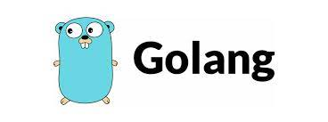

# CURSO DE GOLANG DO BÁSICO AO AVANÇADO

* Golang é uma linguagem de programação de código aberto criada pelo Google.
* O seu foco principal é na produtividade, o que é essencial para quem atua 
  com multiplataforma.

* Popularmente chamada de Go, se diferencia das demais linguagens por ser compilada, 
altamente escalável e que se autodefine como simplista, tendo em vista que facilita
a criação de softwares simples, confiáveis e eficientes.

